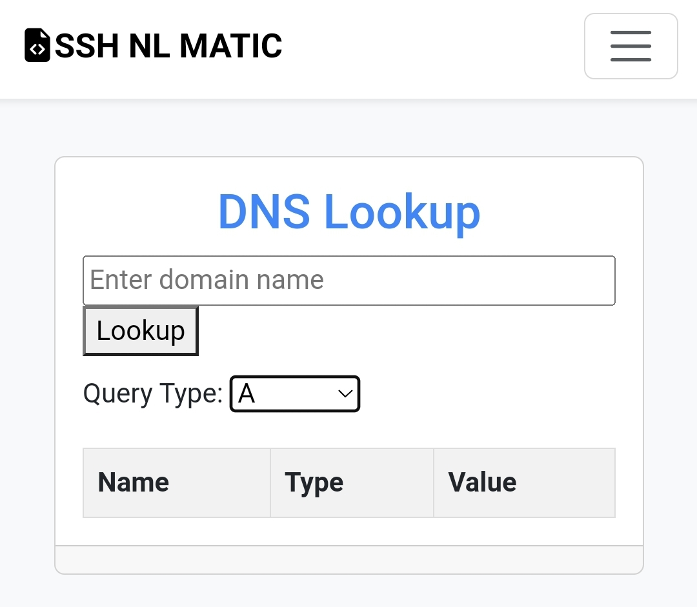
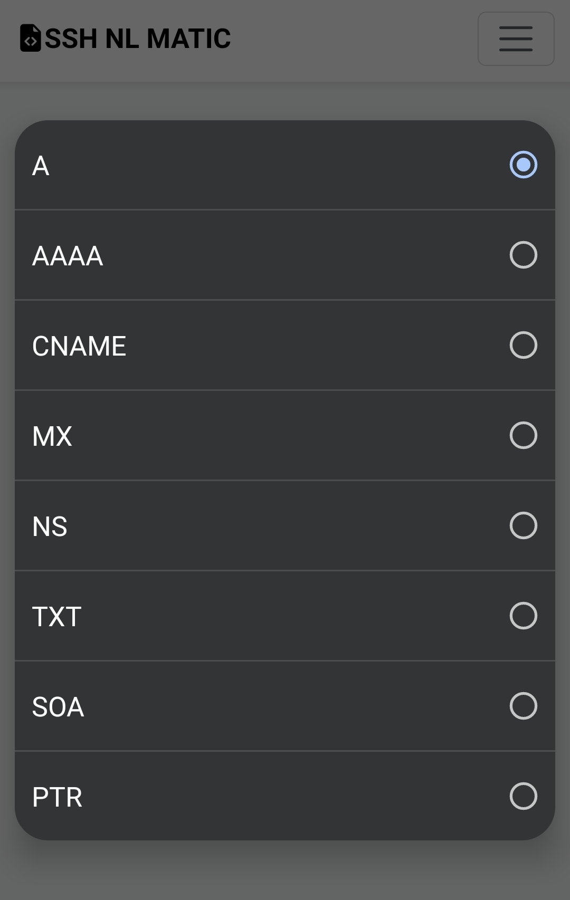

# Blogger DNS Lookup

Simple .XML (HTML) DNS Lookup for Blogger
These codes can be used on pages and posts on Blogger.
Bootstrap hasn't been added here, you can add it as you like

## Screen demo

[]
[]

## HTML

```html
<!DOCTYPE html>
<html>
<head>
    <title>DNS Lookup</title>
    <style>
        body {
            font-family: Arial, sans-serif;
            margin: 0;
            padding: 20px;
        }
        
        h1 {
            color: #4285f4;
            text-align: center;
        }
        
        #search-box {
            width: 100%;
        }
        
        #result {
            margin-top: 20px;
            border-collapse: collapse;
            width: 100%;
        }
        
        #result th, #result td {
            border: 1px solid #ddd;
            padding: 8px;
            text-align: left;
        }
        
        #result th {
            background-color: #f2f2f2;
        }
        
        #query-type {
            margin-top: 10px;
        }
    </style>
</head>
<body>
    <h1>DNS Lookup</h1>
    
    <div>
        <input type="text" id="search-box" placeholder="Enter domain name">
        <button onclick="lookupDNS()">Lookup</button>
    </div>
    
    <div id="query-type">
        <label for="types">Query Type:</label>
        <select id="types">
            <option value="A">A</option>
            <option value="AAAA">AAAA</option>
            <option value="CNAME">CNAME</option>
            <option value="MX">MX</option>
            <option value="NS">NS</option>
            <option value="TXT">TXT</option>
            <option value="SOA">SOA</option>
            <option value="PTR">PTR</option>
        </select>
    </div>
    
    <table id="result">
        <thead>
            <tr>
                <th>Name</th>
                <th>Type</th>
                <th>Value</th>
            </tr>
        </thead>
        <tbody id="result-body"></tbody>
    </table>
    
    <script>
        function lookupDNS() {
            var domain = document.getElementById("search-box").value.trim();
            var type = document.getElementById("types").value;
            if (domain !== "") {
                // Clear previous results
                document.getElementById("result-body").innerHTML = "";
                
                // Perform DNS lookup
                var xhr = new XMLHttpRequest();
                xhr.open("GET", "https://dns.google/resolve?name=" + domain + "&type=" + type, true);
                xhr.onload = function() {
                    if (xhr.status === 200) {
                        var response = JSON.parse(xhr.responseText);
                        if (response.Status === 0) {
                            var answers = response.Answer;
                            if (answers && answers.length > 0) {
                                for (var i = 0; i < answers.length; i++) {
                                    var name = answers[i].name;
                                    var type = answers[i].type;
                                    var data = answers[i].data;
                                    
                                    // Display result
                                    var newRow = document.createElement("tr");
                                    newRow.innerHTML =
                                        "<td>" + name + "</td>" +
                                        "<td>" + type + "</td>" +
                                        "<td>" + data + "</td>";
                                    document.getElementById("result-body").appendChild(newRow);
                                }
                            } else {
                                // No results found
                                var newRow = document.createElement("tr");
                                newRow.innerHTML = "<td colspan='3'>No results found</td>";
                                document.getElementById("result-body").appendChild(newRow);
                            }
                        } else {
                            // DNS lookup error
                            var newRow = document.createElement("tr");
                            newRow.innerHTML = "<td colspan='3'>DNS lookup failed</td>";
                            document.getElementById("result-body").appendChild(newRow);
                        }
                    } else {
                        // HTTP request failed
                        var newRow = document.createElement("tr");
                        newRow.innerHTML = "<td colspan='3'>HTTP request failed</td>";
                        document.getElementById("result-body").appendChild(newRow);
                    }
                }
                xhr.send();
            }
        }
    </script>
</body>
</html>
```
